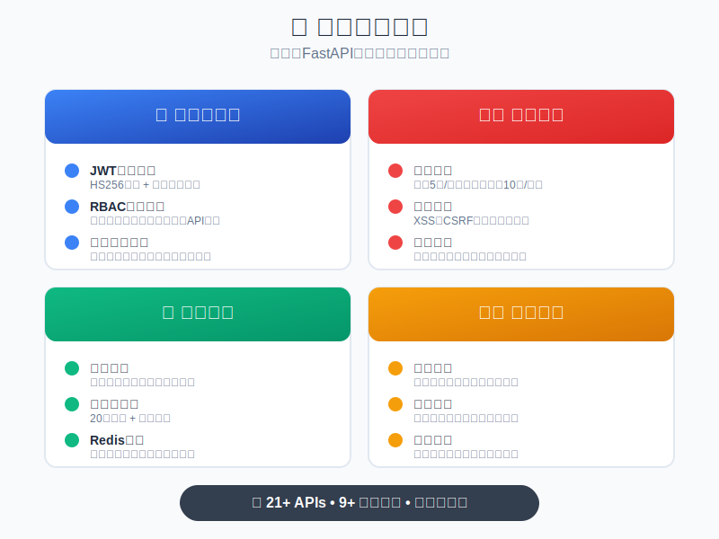

# 🚀 企业级FastAPI后端模板

<div align="center">

**一个功能完整、架构清晰的企业级FastAPI后端模板，专为团队开发设计，开箱即用**

**简体中文** | [English](README.en.md)

<!-- 点赞区域 -->
<div align="center">
  <a href="https://github.com/JiayuXu0/FastAPI-Template" target="_blank">
    
  </a>
</div>

<!-- 互动提示 -->
<p align="center">
  ⭐ <strong>喜欢这个项目？点个Star支持一下！</strong> ⭐
</p>

[](https://www.python.org/downloads/)
[](https://fastapi.tiangolo.com/)
[](https://opensource.org/licenses/MIT)
[](https://github.com/JiayuXu0/FastAPI-Template/stargazers)
[](https://github.com/JiayuXu0/FastAPI-Template/network/members)

[](https://github.com/astral-sh/uv)
[](#)
[](#)
[](https://www.docker.com/)

[📖 快速开始](#-快速开始) • [🏗️ 架构说明](#-架构说明) • [📚 开发指南](CLAUDE.md) • [🌐 官网文档](http://fastapi.infyai.cn/) • [🤝 贡献指南](CONTRIBUTING.md) • [🌟 给个Star!](https://github.com/JiayuXu0/FastAPI-Template)

</div>

---

## 📸 项目预览

<div align="center">

### ✨ 核心特性


### 🛠️ 技术栈


</div>

---

## 🌟 为什么选择这个模板？

<div align="center">

| 🎯 **企业级标准** | ⚡ **开箱即用** | 🛡️ **安全可靠** | 📈 **性能优秀** |
|:---:|:---:|:---:|:---:|
| 三层架构设计<br/>规范清晰 | 5分钟启动项目<br/>零配置烦恼 | RBAC权限控制<br/>多重安全防护 | 异步高并发<br/>现代化技术栈 |

</div>

## ✨ 核心特性

### 🔐 认证与权限
- **JWT身份认证** - 基于HS256算法的安全token认证，支持刷新令牌机制
- **RBAC权限控制** - 角色基础访问控制，支持细粒度API权限
- **用户管理** - 完整的用户注册、登录、权限分配功能
- **角色管理** - 灵活的角色定义和权限分配

### 🗂️ 数据管理
- **菜单管理** - 动态菜单配置，支持多级菜单结构
- **API管理** - 自动化API权限配置和管理
- **部门管理** - 组织架构管理，支持层级结构
- **文件管理** - 安全的文件上传、下载、存储功能

### 🛡️ 安全防护
- **登录限流** - 基于slowapi的智能限流，防暴力破解攻击（5次/分钟）
- **令牌刷新限流** - 刷新令牌接口限流保护（10次/分钟）
- **密码强度** - 强制复杂密码策略（8位+字母数字组合）
- **JWT安全** - 4小时访问令牌+7天刷新令牌机制，自动令牌轮换
- **文件安全** - 文件类型验证、大小限制、恶意文件检测
- **安全头** - 自动XSS、CSRF、点击劫持防护
- **CORS配置** - 严格的跨域访问控制
- **环境验证** - 生产环境配置安全检查
- **审计日志** - 完整的用户操作记录和追踪

### 🏗️ 架构设计
- **三层架构** - API → Service → Repository → Model 清晰分层
- **异步支持** - 全异步设计，高性能处理
- **健康检查** - 系统状态监控和版本信息接口
- **数据库迁移** - 基于Aerich的版本化数据库管理
- **类型安全** - 完整的Python类型注解

### ⚡ 性能优化
- **连接池优化** - 数据库连接池配置，提升并发性能（20连接池+超时控制）
- **缓存系统** - Redis集成，智能缓存策略和用户缓存管理
- **异步架构** - 全异步设计，支持高并发访问
- **性能监控** - 慢查询告警和性能指标追踪

## 🛠️ 技术栈

| 组件 | 技术选型 | 版本要求 |
|------|----------|----------|
| **语言** | Python | 3.11+ |
| **Web框架** | FastAPI | 0.100+ |
| **数据库ORM** | Tortoise ORM | 0.20+ |
| **数据库** | SQLite/PostgreSQL | - |
| **身份认证** | PyJWT | 2.8+ |
| **数据验证** | Pydantic | 2.0+ |
| **数据库迁移** | Aerich | 0.7+ |
| **包管理** | UV | latest |
| **日志** | Loguru | 0.7+ |
| **限流** | SlowAPI | 0.1.9+ |
| **缓存** | Redis | 4.5+ |

## 📁 项目结构

```
evoai-backend-template/
├── src/                          # 📦 源代码目录
│   ├── api/v1/                   # 🌐 API路由层 (轻量化路由)
│   │   ├── users/               # 👥 用户管理API
│   │   ├── roles/               # 👑 角色管理API
│   │   ├── menus/               # 📋 菜单管理API
│   │   ├── files/               # 📁 文件管理API
│   │   └── ...
│   ├── services/                 # 🔧 业务逻辑层 (核心业务)
│   │   ├── base_service.py      # 🏗️ 服务基类和权限服务
│   │   ├── user_service.py      # 👤 用户业务逻辑
│   │   ├── file_service.py      # 📄 文件业务逻辑
│   │   └── ...
│   ├── repositories/             # 🗄️ 数据访问层 (CRUD操作)
│   ├── models/                   # 📊 数据模型层
│   │   ├── admin.py             # 👨‍💼 用户角色模型
│   │   ├── base.py              # 🔷 基础模型类
│   │   └── enums.py             # 📝 枚举定义
│   ├── schemas/                  # ✅ 数据验证层
│   ├── core/                     # ⚙️ 核心功能
│   │   ├── dependency.py        # 🔗 依赖注入
│   │   ├── middlewares.py       # 🛡️ 中间件
│   │   └── init_app.py          # 🚀 应用初始化
│   ├── utils/                    # 🔧 工具函数
│   └── settings/                 # ⚙️ 配置管理
├── migrations/                   # 📈 数据库迁移文件
├── tests/                        # 🧪 测试文件
├── uploads/                      # 📂 文件上传目录
├── logs/                         # 📋 日志文件
├── pyproject.toml               # 📦 UV项目配置
├── .env                         # 🔐 环境变量配置
└── CLAUDE.md                    # 🤖 Claude开发指南
```

## 🚀 快速开始

### 1. 环境准备

```bash
# 安装UV包管理器
curl -LsSf https://astral.sh/uv/install.sh | sh

# 克隆项目
git clone <your-repo-url>
cd evoai-backend-template

# 安装依赖
uv sync
```

### 2. 🔐 环境配置

**复制环境配置文件：**
```bash
cp .env.example .env
```

**⚠️ 必须修改的安全配置：**

| 配置项 | 说明 | 生成方式 |
|--------|------|----------|
| `SECRET_KEY` | JWT签名密钥 | `openssl rand -hex 32` |
| `SWAGGER_UI_PASSWORD` | API文档访问密码 | 设置强密码 |
| `DB_PASSWORD` | 数据库密码 | 设置强密码 |

**配置示例：**
```bash
# 基础配置
SECRET_KEY=your_generated_secret_key_here
APP_TITLE=你的项目名称
PROJECT_NAME=YourProject

# 数据库配置 (开发环境推荐SQLite)
DB_ENGINE=sqlite
DB_PASSWORD=your_strong_password

# API文档保护
SWAGGER_UI_USERNAME=admin
SWAGGER_UI_PASSWORD=your_strong_password

# CORS配置
CORS_ORIGINS=http://localhost:3000,http://localhost:8080
```

### 3. 数据库初始化

```bash
uv run aerich init-db
```

### 4. 启动服务

```bash
# 开发模式
uv run uvicorn src:app --reload --host 0.0.0.0 --port 8000

# 生产模式
uv run uvicorn src:app --host 0.0.0.0 --port 8000 --workers 4
```

### 5. 访问服务

- **🌐 官网文档**: http://fastapi.infyai.cn/
- **API文档**: http://localhost:8000/docs
- **替代文档**: http://localhost:8000/redoc
- **健康检查**: http://localhost:8000/api/v1/base/health
- **版本信息**: http://localhost:8000/api/v1/base/version
- **系统状态**: 实时监控系统运行状态

### 6. 默认账号

```
用户名: admin
密码: abcd1234
```

**🚨 首次登录后立即修改密码！**

---

## 📊 项目统计

<div align="center">


</div>

## 🎉 成功案例

> 💡 **已有多个团队使用此模板快速搭建生产级后端服务**

- 🏢 **企业管理系统** - 支持10万+用户的权限管理平台
- 🛒 **电商后台** - 高并发订单处理系统  
- 📱 **移动应用API** - 微服务架构的用户中心
- 🎯 **SaaS平台** - 多租户权限隔离系统

**👥 如果你也在使用这个模板，[告诉我们](https://github.com/JiayuXu0/FastAPI-Template/discussions)你的使用案例！**

## 🏗️ 架构说明

### 三层架构模式

```
┌─────────────────┐
│   API Layer     │  ← 路由分发、参数验证
│  (api/v1/)      │
├─────────────────┤
│  Service Layer  │  ← 业务逻辑、权限检查
│  (services/)    │
├─────────────────┤
│Repository Layer │  ← 数据库操作、CRUD
│ (repositories/) │
├─────────────────┤
│  Model Layer    │  ← 数据模型定义
│   (models/)     │
└─────────────────┘
```

### 核心设计原则

1. **单一职责** - 每层只处理自己的逻辑
2. **依赖注入** - 通过FastAPI依赖系统管理
3. **类型安全** - 完整的Python类型注解
4. **异步优先** - 全异步设计，高并发支持
5. **安全第一** - 内置多重安全防护机制

## 📚 开发指南

### 添加新功能

1. **定义数据模型** (`models/`)
2. **创建数据Schema** (`schemas/`)
3. **实现Repository** (`repositories/`)
4. **编写Service业务逻辑** (`services/`)
5. **添加API路由** (`api/v1/`)
6. **生成数据库迁移** (`aerich migrate`)

详细步骤请参考 [CLAUDE.md](CLAUDE.md) 开发指南。

### 📖 文档系统

本项目集成了强大的文档系统，基于 **MkDocs Material** 构建，提供美观且功能完整的项目文档。

#### ✨ 文档特性
- **🤖 自动API文档生成** - 从FastAPI代码自动提取API信息
- **📝 详细的参数说明** - 包含请求参数、响应格式、使用示例
- **🎨 Material Design** - 现代化的UI设计，支持暗黑模式
- **🔍 全文搜索** - 快速查找文档内容
- **📱 响应式设计** - 完美支持移动端访问
- **🌐 多语言支持** - 中英文文档

#### 📂 文档结构
```
docs/
├── index.md              # 📋 项目主页
├── guide/                 # 🚀 快速开始指南
├── architecture/          # 🏗️ 架构设计文档
├── api/                   # 📚 API接口文档
│   ├── index.md          # API总览
│   ├── base.md           # 认证授权 (自动生成)
│   ├── users.md          # 用户管理 (自动生成)
│   ├── role.md           # 角色管理 (自动生成)
│   └── ...               # 其他API模块
├── changelog.md           # 📝 更新日志
├── faq.md                # ❓ 常见问题
└── gen_pages.py          # 🔧 文档生成脚本
```

#### 🚀 启动文档服务
```bash
# 安装文档依赖
uv sync --group docs

# 启动开发服务器 (支持热重载)
uv run mkdocs serve

# 构建静态文档
uv run mkdocs build

# 部署到GitHub Pages
uv run mkdocs gh-deploy
```

#### 🔄 自动生成API文档
```bash
# 手动生成API文档 (通常自动执行)
uv run python docs/gen_pages.py
```

#### 📋 API文档包含内容
- **完整的参数表格** - 参数名、类型、是否必填、默认值、描述
- **请求体结构** - Pydantic模型字段详情和JSON示例
- **响应格式说明** - 成功/错误响应示例
- **实用的代码示例** - cURL和Python requests使用示例
- **认证要求** - Bearer Token使用说明

#### 🌐 在线访问
- **🌐 官网文档**: http://fastapi.infyai.cn/
- **本地文档**: http://localhost:8000 (mkdocs serve)
- **Swagger UI**: http://localhost:8000/docs
- **ReDoc**: http://localhost:8000/redoc

> 💡 **提示**: API文档会随代码变更自动更新，确保文档与代码始终保持同步！

### 数据库操作

```bash
# 生成迁移文件
uv run aerich migrate --name "add_new_feature"

# 应用迁移
uv run aerich upgrade

# 查看迁移历史
uv run aerich history
```

### 测试

```bash
# 运行所有测试
uv run pytest

# 运行特定测试
uv run pytest tests/test_users.py

# 生成覆盖率报告
uv run pytest --cov=src --cov-report=html
```

## 🔒 安全最佳实践

### 生产环境安全检查

#### ✅ 自动检查项
- [x] **SECRET_KEY** 自动生成安全密钥，至少32字符
- [x] **密码强度** 强制8位+字母数字组合
- [x] **登录限流** 自动防暴力破解攻击
- [x] **JWT安全** 4小时过期+刷新机制
- [x] **环境验证** 生产环境配置自动检查
- [x] **错误保护** 生产环境隐藏技术细节

#### 📋 手动检查项
- [ ] **DEBUG模式** 生产环境设置 `DEBUG=False`
- [ ] **数据库** 使用PostgreSQL而非SQLite
- [ ] **CORS配置** 设置具体域名，移除localhost
- [ ] **HTTPS** 生产环境启用HTTPS
- [ ] **数据库安全** 使用独立数据库账号，限制权限
- [ ] **Swagger密码** 设置强密码保护API文档

### 文件上传安全

- 支持的文件类型白名单验证
- 文件大小限制 (默认500MB)
- 危险文件类型黑名单检测
- 安全的文件名生成机制
- 本地文件存储 (可扩展至云存储)

## 🔧 配置说明

### 环境变量

| 变量名 | 必填 | 默认值 | 说明 |
|--------|------|--------|------|
| `SECRET_KEY` | ✅ | 自动生成 | JWT签名密钥（至少32字符） |
| `SWAGGER_UI_PASSWORD` | ✅ | - | API文档访问密码（至少8位） |
| `JWT_ACCESS_TOKEN_EXPIRE_MINUTES` | ❌ | 240 | JWT访问令牌过期时间（分钟） |
| `JWT_REFRESH_TOKEN_EXPIRE_DAYS` | ❌ | 7 | JWT刷新令牌过期时间（天） |
| `APP_TITLE` | ❌ | Vue FastAPI Admin | 应用标题 |
| `DB_ENGINE` | ❌ | postgres | 数据库类型 |
| `DB_HOST` | ❌ | localhost | 数据库主机 |
| `DB_PASSWORD` | ⚠️ | - | 数据库密码（生产环境必填） |
| `CORS_ORIGINS` | ❌ | localhost:3000 | 允许的CORS源 |
| `DEBUG` | ❌ | True | 调试模式 |
| `APP_ENV` | ❌ | development | 应用环境（development/production） |

### 数据库支持

- **SQLite** - 适合开发和小型部署
- **PostgreSQL** - 推荐生产环境使用

## 📈 性能优化

### 🚀 已实现的优化
- **异步处理** - 全异步架构，支持高并发
- **登录限流** - 防暴力破解，每分钟最多5次尝试
- **密码策略** - 强制复杂密码，提升账户安全
- **JWT优化** - 4小时短期令牌+刷新机制
- **错误保护** - 生产环境隐藏技术细节
- **健康监控** - 系统状态和版本信息接口

### 🔄 计划中的优化
- **性能监控** - 慢查询告警和指标追踪
- **中间件** - 请求压缩、缓存头设置
- **GraphQL** - GraphQL接口支持
- **WebSocket** - 实时通信功能

## 🤝 贡献指南

1. Fork 项目仓库
2. 创建功能分支 (`git checkout -b feature/amazing-feature`)
3. 提交改动 (`git commit -m 'Add some amazing feature'`)
4. 推送分支 (`git push origin feature/amazing-feature`)
5. 创建 Pull Request

### 代码规范

- 遵循 **PEP 8** 编码规范
- 使用 **Google风格** 文档字符串
- 添加 **类型注解** 到所有函数
- 编写 **单元测试** 覆盖关键功能

## 📄 许可证

本项目基于 [MIT License](LICENSE) 开源协议。

## 🔗 相关链接

- [FastAPI官方文档](https://fastapi.tiangolo.com/)
- [Tortoise ORM文档](https://tortoise.github.io/)
- [UV包管理器](https://github.com/astral-sh/uv)
- [Claude Code文档](https://docs.anthropic.com/en/docs/claude-code)

---

## 🆘 获取帮助

如果您在使用过程中遇到问题：

1. 📖 查看 [CLAUDE.md](CLAUDE.md) 详细开发指南
2. 🔍 查看 [Issues](../../issues) 查找类似问题
3. 💬 创建新的 [Issue](../../issues/new) 描述问题
4. 📧 联系维护者

**开箱即用，专业可靠的企业级FastAPI后端模板** 🚀

## 📝 更新日志

### 🆕 v1.2.0 - 性能与安全双重升级 (2025-07-14)

#### ⚡ 性能优化
- ✅ **数据库连接池优化** - 20连接池+超时控制，提升并发性能
- ✅ **Redis缓存集成** - 智能缓存策略，用户数据缓存管理
- ✅ **缓存装饰器** - 优雅的缓存解决方案，TTL可配置
- ✅ **用户缓存管理** - 自动缓存清理机制

#### 🔐 JWT安全增强
- ✅ **刷新令牌机制** - 7天刷新令牌+自动轮换策略
- ✅ **双令牌系统** - 访问令牌(4小时)+刷新令牌(7天)
- ✅ **令牌类型验证** - 防止令牌类型错误使用
- ✅ **刷新接口限流** - 10次/分钟刷新保护

#### 🏥 监控功能
- ✅ **健康检查接口** - `/api/v1/base/health`
- ✅ **版本信息接口** - `/api/v1/base/version`
- ✅ **系统状态监控** - 实时服务状态展示

#### 🛠️ 开发体验
- ✅ **自动SECRET_KEY生成** - 无需手动配置
- ✅ **详细错误提示** - 开发环境友好的错误信息
- ✅ **配置验证增强** - 启动时自动检查配置

### 📋 v1.0.0 - 基础版本
- 🏗️ 三层架构设计
- 🔐 RBAC权限管理
- 📊 完整CRUD操作
- 🗄️ 数据库迁移支持

---

## 🏆 特色亮点

<div align="center">

<!-- 成就展示 -->
<div align="center">

### 🎯 已获得开发者认可

| ⭐ **Stars** | 🍴 **Forks** | 👥 **用户** |
|:---:|:---:|:---:|
| 持续增长 | 活跃使用 | 企业级 |

</div>

### 🚀 快速上手
```bash
curl -LsSf https://astral.sh/uv/install.sh | sh
git clone https://github.com/JiayuXu0/FastAPI-Template.git
cd FastAPI-Template && uv sync && cp .env.example .env
uv run aerich init-db && uv run uvicorn src:app --reload
# 🎉 5分钟内即可启动完整的企业级后端服务！
```

### 💎 技术栈对比

| 传统方案 ❌ | 本模板 ✅ |
|:---:|:---:|
| 复杂的环境配置 | UV一键管理依赖 |
| 混乱的项目结构 | 清晰的三层架构 |
| 手动权限管理 | 完整RBAC系统 |
| 缺乏安全防护 | 多重安全机制 |
| 文档不完善 | 详细开发指南 |

</div>

## 🌟 社区支持

<div align="center">

**加入我们的开发者社区，一起打造更好的后端模板！**

<!-- Star呼吁 -->
<div align="center">

### 🚀 支持项目发展

如果这个项目对你有帮助，请给我们一个Star⭐

<a href="https://github.com/JiayuXu0/FastAPI-Template" target="_blank">
  
</a>

</div>

[](https://github.com/JiayuXu0/FastAPI-Template/discussions)
[](https://github.com/JiayuXu0/FastAPI-Template/issues)
[](https://github.com/JiayuXu0/FastAPI-Template/pulls)

[💬 讨论交流](https://github.com/JiayuXu0/FastAPI-Template/discussions) • [🐛 报告问题](https://github.com/JiayuXu0/FastAPI-Template/issues) • [🔀 提交PR](https://github.com/JiayuXu0/FastAPI-Template/pulls)

</div>

## 🎯 路线图

- [x] ✅ **v1.0** - 基础三层架构和RBAC系统
- [x] ✅ **v1.1** - UV包管理器集成
- [x] ✅ **v1.2** - 数据库连接池优化+Redis缓存+JWT刷新机制
- [ ] 🚧 **v1.3** - GraphQL API支持
- [ ] 📅 **v1.4** - 微服务架构扩展
- [ ] 📅 **v1.5** - 实时通信 (WebSocket)
- [ ] 📅 **v2.0** - 云原生部署方案

[查看完整路线图 →](https://github.com/JiayuXu0/FastAPI-Template/projects)

---