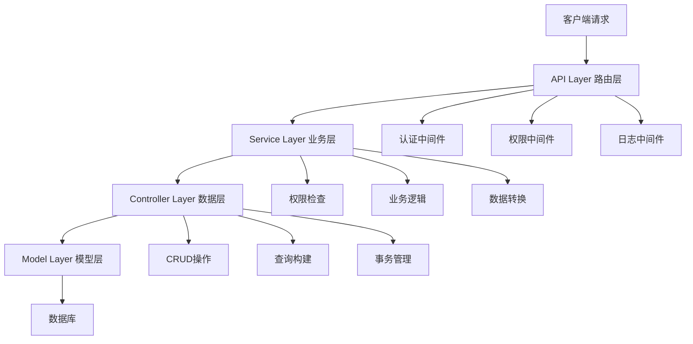
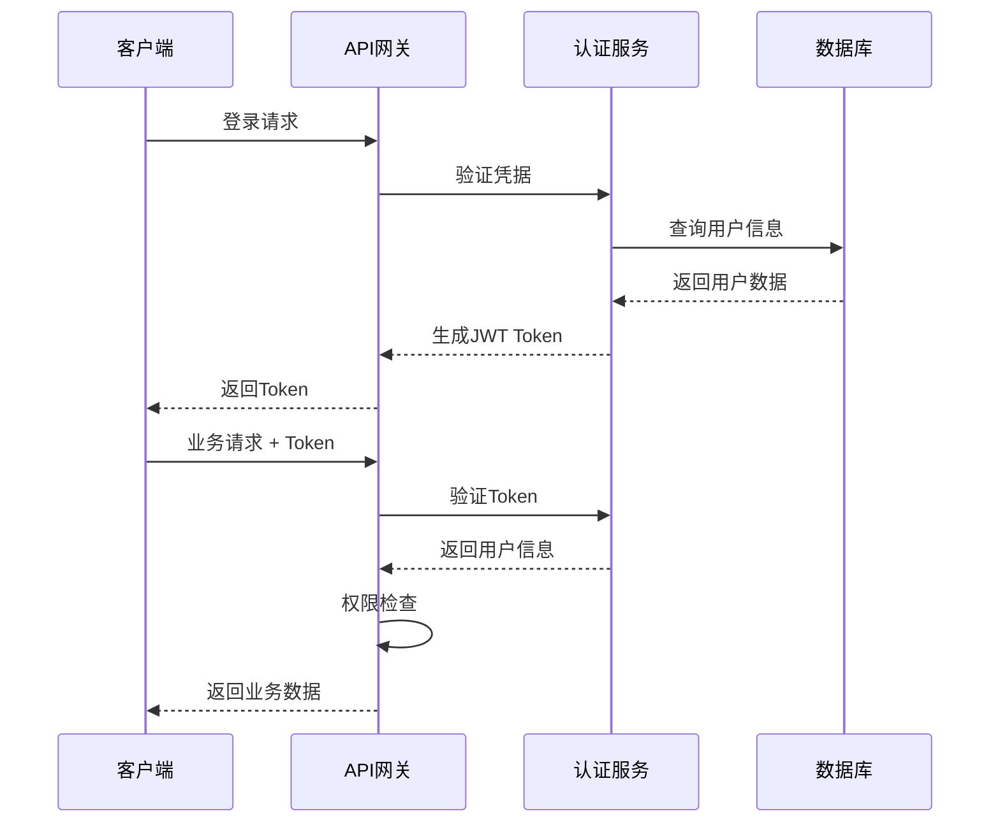

# 🏗️ 架构设计文档

## 📋 概述

本文档详细描述了企业级FastAPI后端模板的架构设计理念、核心组件和最佳实践。

## 🎯 设计目标

- **🔧 可维护性** - 清晰的分层架构，职责分离
- **🚀 可扩展性** - 易于添加新功能和模块  
- **🛡️ 安全性** - 多重安全防护机制
- **⚡ 性能** - 异步处理，高并发支持
- **📚 易用性** - 简单的部署和开发流程

## 🏢 三层架构详解

### 🌐 API Layer (路由层)
**职责**: 处理HTTP请求和响应
- 参数验证和类型转换
- 路由分发
- 认证和权限检查
- 响应格式化

**特点**:
- 轻量级，只包含路由逻辑
- 统一的错误处理
- 自动API文档生成

### 🔧 Service Layer (业务层)
**职责**: 核心业务逻辑处理
- 复杂业务规则验证
- 跨模块业务协调
- 权限业务逻辑
- 异常处理和日志

**特点**:
- 可复用的业务组件
- 事务边界管理
- 统一的权限检查

### 🗄️ Controller Layer (数据层)
**职责**: 数据访问和持久化
- CRUD基础操作
- 查询条件构建
- 数据模型转换
- 关联数据加载

**特点**:
- 继承通用CRUD基类
- 类型安全的数据操作
- 自动化查询优化

### 📊 Model Layer (模型层)
**职责**: 数据模型定义
- 数据库表结构
- 字段验证规则
- 模型关系定义
- 索引配置

## 🔐 安全架构

### 认证流程

### 权限控制
- **RBAC模型**: 基于角色的访问控制
- **API级权限**: 细粒度的接口访问控制
- **数据级权限**: 基于用户角色的数据过滤
- **动态权限**: 支持运行时权限配置

## 📈 性能优化

### 数据库优化
- **连接池**: 异步数据库连接池
- **查询优化**: 预加载关联数据
- **索引策略**: 关键字段索引优化
- **事务管理**: 最小事务边界

### 缓存策略
- **应用缓存**: 热点数据内存缓存
- **查询缓存**: 复杂查询结果缓存
- **会话缓存**: 用户会话状态缓存

### 异步处理
- **异步I/O**: 全异步数据库操作
- **并发处理**: 高并发请求支持
- **任务队列**: 后台任务异步处理

## 🛠️ 开发工具链

### 代码质量
- **Ruff**: 代码检查和格式化
- **MyPy**: 静态类型检查
- **pytest**: 单元测试和集成测试
- **Coverage**: 代码覆盖率检查

### 依赖管理
- **UV**: 现代化包管理器
- **锁定文件**: 确保依赖版本一致性
- **虚拟环境**: 隔离的开发环境

### CI/CD
- **GitHub Actions**: 自动化测试和部署
- **Docker**: 容器化部署
- **多环境**: 开发、测试、生产环境

## 🔄 扩展指南

### 添加新功能模块
1. 定义数据模型 (`models/`)
2. 创建Schema验证 (`schemas/`)  
3. 实现数据层 (`controllers/`)
4. 编写业务层 (`services/`)
5. 添加API路由 (`api/v1/`)
6. 生成数据库迁移
7. 编写测试用例

### 微服务化改造
- **服务拆分**: 按业务域拆分独立服务
- **API网关**: 统一入口和路由
- **服务发现**: 动态服务注册与发现
- **分布式事务**: 跨服务事务处理

## 📋 最佳实践

### 代码组织
- 单一职责原则
- 依赖注入模式
- 异常统一处理
- 日志结构化

### 安全实践
- 密钥管理
- 输入验证
- SQL注入防护
- XSS攻击防护

### 性能实践
- 数据库查询优化
- 缓存策略应用
- 异步编程模式
- 资源监控告警

## 📚 参考文档

- [FastAPI官方文档](https://fastapi.tiangolo.com/)
- [Tortoise ORM文档](https://tortoise.github.io/)
- [Clean Architecture](https://blog.cleancoder.com/uncle-bob/2012/08/13/the-clean-architecture.html)
- [微服务架构模式](https://microservices.io/)